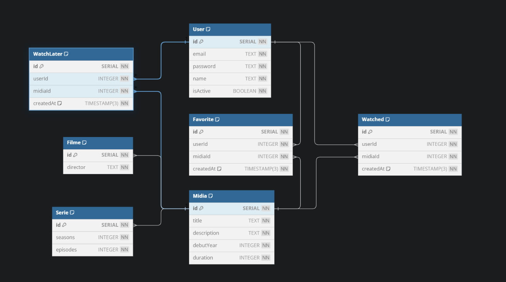

# Visão Arquitetural - Dados

## Introdução

A visão de dados é essencial para entendermos como os dados da plataforma My_video são organizados, acessados e manipulados. Por meio do diagramas de classe mapeamos os objetos que dizem respeiro às entidades do nosso banco de dados, destacando, por exemplo, as chaves primárias, estrangeiras, tipo dos dados. Ao longo deste artefato, apresentaremos entidades e relacionamentos que garantem a funcionalidade da plataforma, como usuários, mídia, filmes, séries, listas de favoritos, e conteúdos assistidos. Cada entidade foi modelada afim e passar a visão comportamental e as necessidades da aplicação, permitindo que os dados fluam de maneira ordenada e que cada interação do usuário com a plataforma seja registrada e tratada corretamente.

## Metodologia

Para a construção da visão arquitetural de dados, adotamos uma abordagem baseada no código gerado diretamente pelo PostgreSQL, que está sendo desenvolvido para o backend da aplicação. Esse código serviu como a principal fonte de referência para o mapeamento das entidades e seus atributos.

A partir desse código, e utilizando como comparação o [Diagrama de Classes](https://github.com/UnBArqDsw2024-1/2024.1_G4_My_Video/blob/main/docs/Modelagem/2.1.1.1.DiagramadeClasses.md) desenvolvido na Entrega 2, destacamos as propriedades fundamentais, como chaves primárias, estrangeiras, tipos de dados e relacionamentos entre as entidades. Essa metodologia nos permitiu alinhar o modelo de dados diretamente com a implementação em desenvolvimento, garantindo que o diagrama de classes refletisse fielmente a estrutura do banco de dados.

Essa comparação nos ajudou a verificar a consistência e a evolução do modelo de dados ao longo do desenvolvimento do projeto, destacando eventuais ajustes necessários para o alinhamento com a visão arquitetural proposta.

<b>ENTIDADES</b>

    • User

    • Midia

    • Favorite

    • Watched

    • Serie

    • Filme

    • WatchLater

<b>ATRIBUTOS</b>

    • User(id, email, password, name, isActive)

    • Midia(id, title, description, debutYear, duration)

    • Favorite(id, userId, midiaId, createdAt)

    • Watched(id, userId, midiaId, createdAt)

    • Serie(id, seasons, episodes)

    • Filme(id, director)

    • WatchLater(id, userId, midiaId, cretedAt)

<b>RELACIONAMENTOS</b>

    • User - adiciona mida a lista - Watched (1,n)

    • User - adiciona mida a lista - WatchLater (1,n)

    • User - adiciona mida a lista - Favorite (1,n)

    • Midia - pode ser favoritada - Favorite (1,n)

    • Midia - é assistida - Watched (1,n)

    • Midia - pode ser - Serie (1,n)

    • Midia - pode ser - Filme (1,n)

    • Midia - pode ser adicionada a lista - WatchLater (1,n)

## Diagrama

    
Figura 1 - Diagrama Visão Arquitetural - Dados. (Fonte: Ana Rocha, Gabriel Rosa, Luiz Gustavo, Marcelo Ferreira. 2024)

## Conclusão

Como conclusão, a visão arquitetural apresentada aborda a estrutura dos principais dados de um sistema de streaming. O artefato inclui entidades essenciais, como *User*, *Midia* e suas relações com favoritos, mídias assistidas e a funcionalidade de "assistir mais tarde". Além disso, categorias específicas como *Série* e *Filme* foram devidamente separadas, garantindo flexibilidade no tratamento dessas diferentes mídias. Esse modelo fornece uma base sólida para futuras expansões e integrações do sistema, ao mesmo tempo em que mantém a simplicidade e organização dos dados.

## Referências

- SERRANO, Milene. Slide "AULA - ARQUITETURA & DAS – PARTE II". Disponível em: [Aprender 3](https://aprender3.unb.br/pluginfile.php/2790287/mod_label/intro/Arquitetura%20e%20Desenho%20de%20Software%20-%20Aula%20Arquitetura%20e%20DAS%20-%20Parte%20II%20-%20Profa.%20Milene.pdf). Acesso em 15 ago. de 2024.  

## Histórico de Versão

| Versão | Data da alteração |             Alteração             |   Autor(es)   |           Revisor(es)       | Data de revisão |
| :----: | :---------------: | :-------------------------------: | :---------------------------------------------: | :---------------------------------------------: | :-------------: |
|  1.0   | 15/08/2024 | Criação do documento | [Ana Rocha](https://github.com/anaaroch) e [Luiz Gustavo](https://github.com/Luiz-GL-Campos) | [Breno Yuri](https://github.com/YuriBre)|  16/08/2024  |
|  1.1   | 16/08/2024 | Adição da metodologia | [Lucas Ribeiro](https://github.com/lucassouzs) |  |  |
