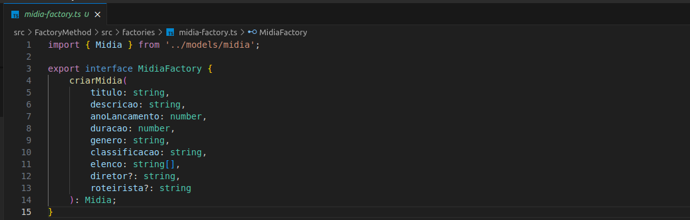
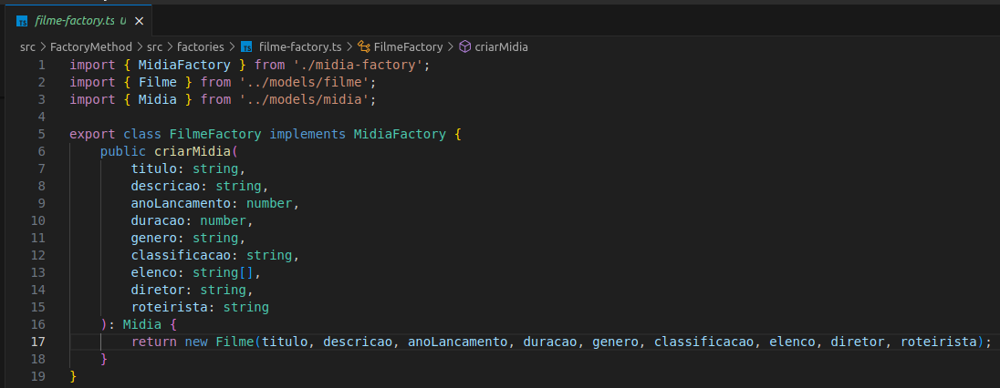
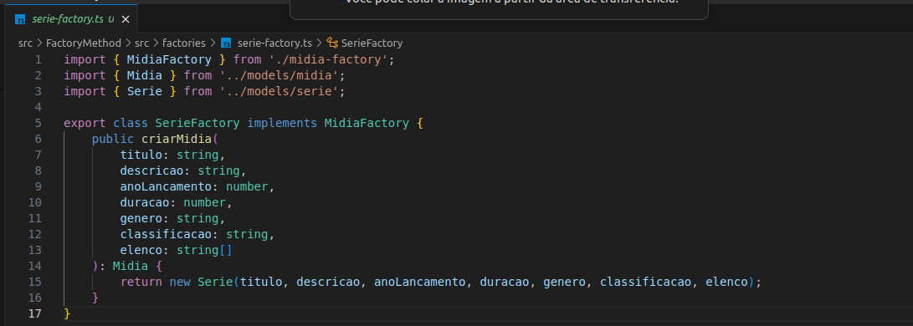
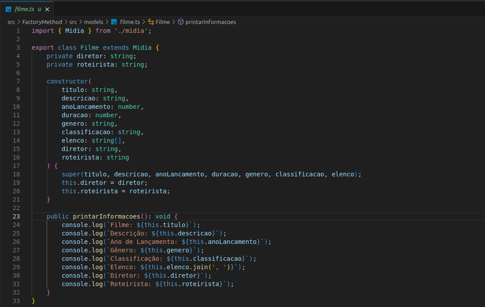
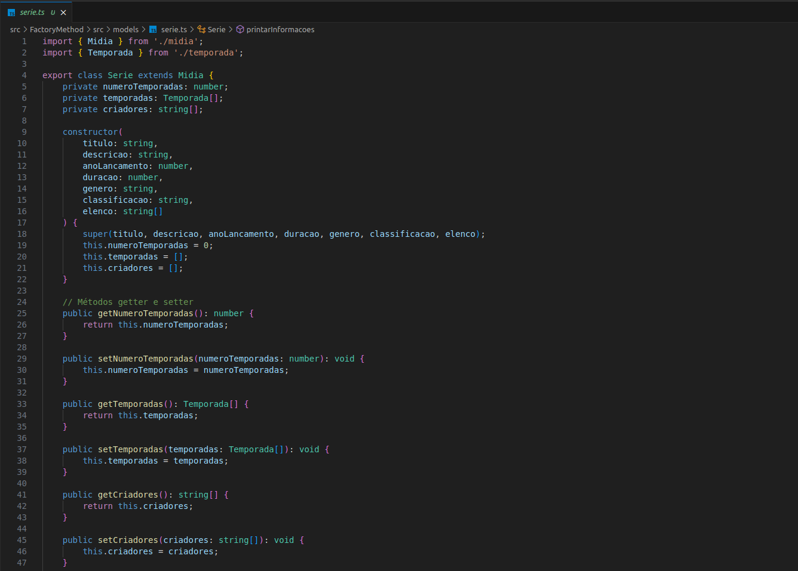

## Reutilização de Software

#### Introdução
A reutilização de software é um princípio fundamental na engenharia de software que visa aumentar a eficiência do processo de desenvolvimento, reduzir custos e melhorar a qualidade dos sistemas. Ao reutilizar componentes de software existentes, as equipes podem evitar a duplicação de esforços, garantir a consistência e acelerar o tempo de entrega. Este foco explora a aplicação do conceito de reutilização de software dentro de um projeto, fornecendo um exemplo prático que ilustra tanto a parte conceitual quanto o código associado.

#### Conceito de Reutilização de Software
Reutilização de software refere-se ao uso de componentes, módulos, bibliotecas ou até mesmo frameworks que foram desenvolvidos anteriormente em novos projetos ou contextos. A reutilização pode ocorrer em diferentes níveis, incluindo:

- **Código**: Reuso de funções, classes ou módulos previamente desenvolvidos.
- **Bibliotecas**: Integração de bibliotecas de terceiros que fornecem funcionalidades específicas.
- **Arquitetura**: Adaptação de padrões de design e arquiteturas estabelecidas para novos projetos.

Os principais benefícios da reutilização incluem:

- **Redução de custos**: Menos código precisa ser escrito do zero.
- **Aumento da qualidade**: Componentes reutilizados geralmente já foram testados e refinados.
- **Consistência**: Manter um estilo e comportamento consistente em várias partes do software.

### Exemplo de Reutilização

## Factory Method

### 1. Aplicação
O padrão de projeto Factory Method é uma ferramenta poderosa para promover a reutilização de código em sistemas de software. Ele permite que a criação de objetos seja encapsulada e delegada a subclasses especializadas, facilitando a manutenção e expansão do sistema sem a necessidade de modificar o código existente.

### 2. Modelagem
<iframe allowfullscreen frameborder="0" style="width:640px; height:480px" src="https://lucid.app/documents/embedded/88f1a1d7-01af-4a50-875f-9473e161e679" id="4xiXPVw9lOHQ"></iframe>
Fonte: Gabriel Zaranza, 2024

### 3. Código
Para acessar a implementação em código do Factory Method, basta clicar [aqui](https://github.com/UnBArqDsw2024-1/2024.1_G4_My_Video/tree/main/src/FactoryMethod). Nesta pasta podemos encontrar todos os arquivos que irão servir de base para o Factory Method, assim como serão mostrados nesse documento.

Os códigos foram desenvolvidos em TypeScript e estão organizados em três tipos principais de arquivos: **factories**, **models** e **principal**.

- **Factories**: Os arquivos deste tipo implementam o padrão de projeto Factory Method, que é utilizado para criar objetos sem especificar a classe exata do objeto a ser criado. Eles contêm as interfaces e as implementações concretas das fábricas, que são responsáveis por instanciar objetos das classes de modelo apropriadas.
- **Models**: Os arquivos deste tipo definem as classes de modelo usadas na aplicação. Estas classes representam os dados e comportamentos dos objetos que serão criados pelas fábricas.
- **Principal**: O arquivo `principal.ts` contém o código principal que utiliza as fábricas para criar e manipular objetos das classes de modelo. Este arquivo é responsável por testar a implementação do padrão Factory Method e verificar se as instâncias das classes são criadas e manipuladas corretamente.

Cada um desses arquivos é crucial para a implementação e o entendimento do padrão Factory Method, oferecendo uma visão clara de como o padrão é aplicado para criar e gerenciar instâncias de objetos na aplicação, como podemos ver nas figuras 1-10:

**Factories:**

- `midia-factory.ts`:
    
  **Figura 1 - Midia Factory.** (Fonte: Catlen Cleane e Gabriel Zaranza . 2024)

- `filme-factory.ts`:
    
  **Figura 2 - Filme Factory.** (Fonte: Catlen Cleane e Gabriel Zaranza . 2024)

- `serie-factory.ts`:
    
  **Figura 3 - Serie Factory.** (Fonte: Catlen Cleane e Gabriel Zaranza  . 2024)

**Models:**

- `filme.ts`:
    
  **Figura 4 - Filme Model.** (Fonte: Catlen Cleane e Gabriel Zaranza . 2024)

- `serie.ts`:
    
  **Figuras 5 e 6 - Serie Model.** (Fonte: Catlen Cleane e Gabriel Zaranza . 2024)

Um dos exemplos é a reutilização dessas partes usando o padrão Factory Method.

## Exemplos de Reutilização em Diferentes Contextos

Além do Factory Method, a reutilização de software pode ocorrer em diversos outros contextos e níveis:

- **Microserviços**: Componentes de software são desenvolvidos como serviços independentes que podem ser reutilizados em diferentes partes de uma aplicação ou em diferentes aplicações.
- **Bibliotecas de Terceiros**: O uso de bibliotecas como lodash em JavaScript ou NumPy em Python são exemplos comuns de reutilização de software para manipulação de dados, matemática, ou tarefas utilitárias.
- **Frameworks**: Frameworks como Django, Laravel ou React oferecem componentes prontos que podem ser reutilizados para acelerar o desenvolvimento de aplicações web.

Esses exemplos mostram como a reutilização pode variar desde simples funções até grandes componentes arquiteturais.

## Desafios e Limitações da Reutilização

Embora a reutilização de software traga muitos benefícios, ela não está isenta de desafios:

- **Dependências Excessivas**: A reutilização pode levar à criação de dependências entre componentes que, se não forem gerenciadas corretamente, podem dificultar a manutenção e atualização do software.
- **Complexidade**: Reutilizar componentes em contextos diferentes do original pode introduzir complexidade adicional, exigindo adaptações ou criando situações onde o componente não se encaixa perfeitamente.
- **Problemas de Integração**: Componentes reutilizados podem ter sido desenvolvidos com suposições ou dependências específicas que não se alinham perfeitamente com o novo contexto.

## Conclusão

A reutilização de software, quando aplicada corretamente, pode transformar o desenvolvimento de sistemas em um processo mais eficiente, econômico e de alta qualidade. O exemplo prático apresentado com a aplicação do padrão Factory Method ilustra como esse conceito pode ser implementado de forma concreta, permitindo a criação de objetos de maneira flexível e extensível.

Por meio da reutilização de componentes, como classes e fábricas, evitam-se redundâncias, melhorando a manutenção e a escalabilidade do sistema. No entanto, é importante ressaltar que a reutilização de software também deve ser planejada e estruturada cuidadosamente para evitar dependências excessivas ou complexidade desnecessária.

Assim, a reutilização de software, exemplificada pelo uso do Factory Method, não é apenas uma prática recomendada, mas uma necessidade para desenvolvedores que buscam criar sistemas robustos, manuteníveis e eficientes.

## Histórico de Versão

| Versão | Data da alteração |            Alteração             |                                           Autor(es)                                           |                                                                   Revisor(es)                                                                    | Data de revisão |
| :----: | :---------------: | :------------------------------: | :-------------------------------------------------------------------------------------------: | :----------------------------------------------------------------------------------------------------------------------------------------------: | :-------------: |
|  1.0   |    15/08/2024     |    Introdução, reutilização usando factory method  | [Lucas Lobão](https://github.com/lucaslobao-18), [Catlen Cleane](https://github.com/catlenc) e [Gabriel Zaranza](https://github.com/GZaranza) | [Ana Rocha](https://github.com/anaaroch) e [Luiz Gustavo](https://github.com/Luiz-GL-Campos) | 15/08/2024 |
|  1.1   |    15/08/2024     |    Inserindo conclusão do documento.  | [Gabriel Rosa](https://github.com/gabrielrosa09) | [Ana Rocha](https://github.com/anaaroch) e [Luiz Gustavo](https://github.com/Luiz-GL-Campos) | 15/08/2024 |
|  1.2   |    16/08/2024     |    Inserindo as seções de Exemplos de Reutilização em Diferentes Contextos e Desafios e Limitações da Reutilização  | [Lucas Ribeiro](https://github.com/lucassouzs) |  |  |
