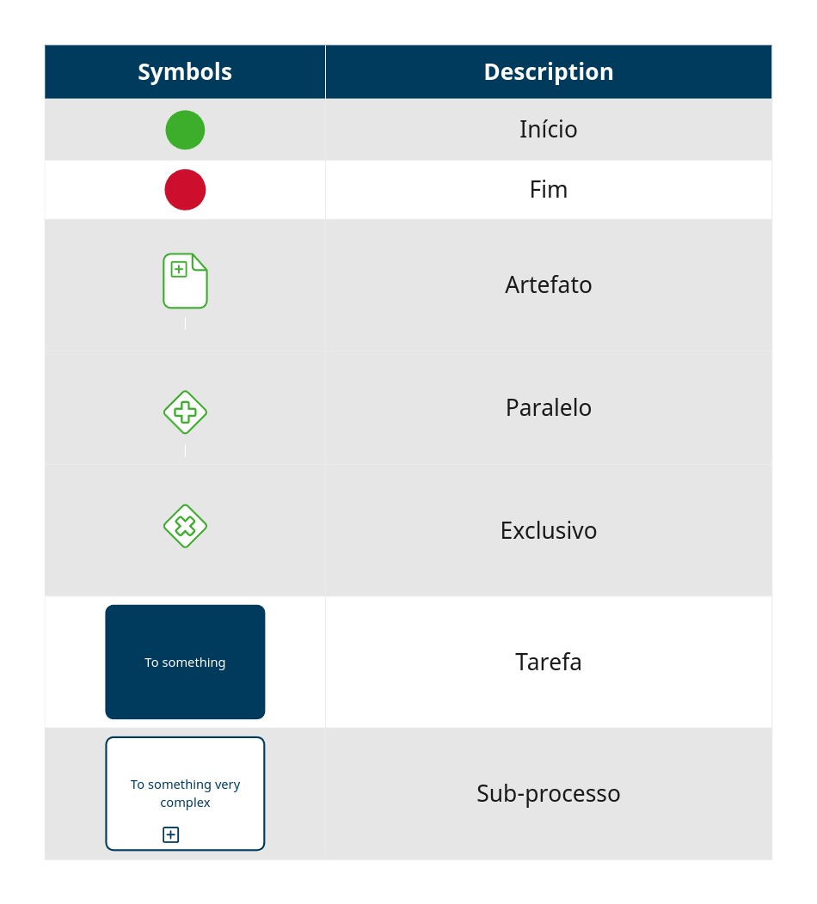
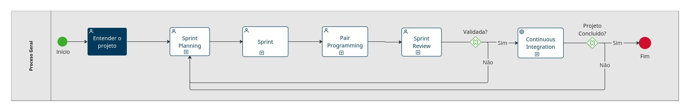
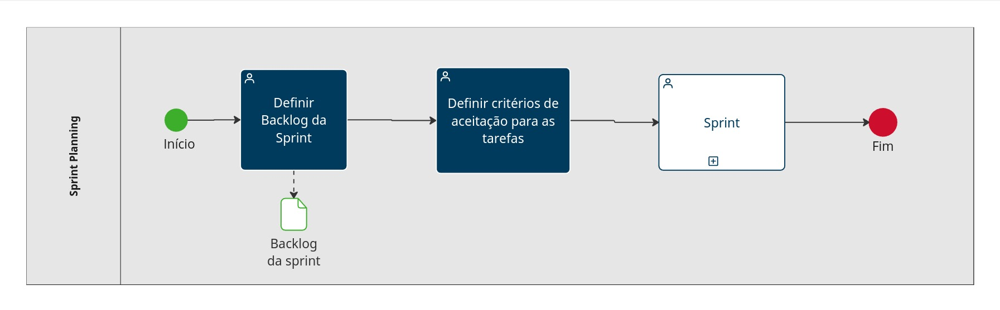
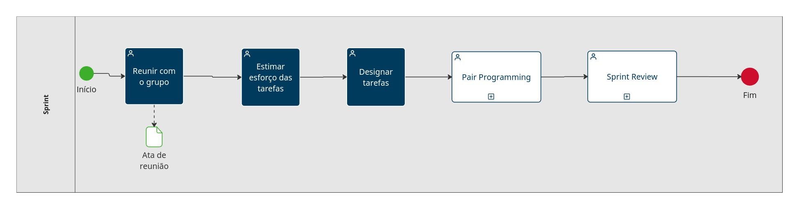
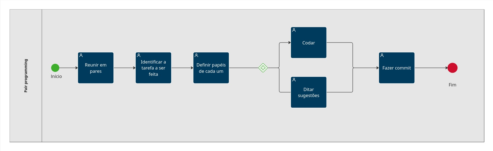
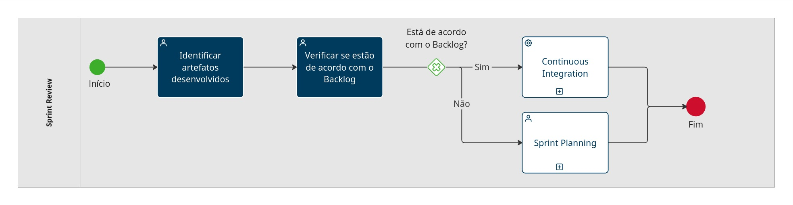
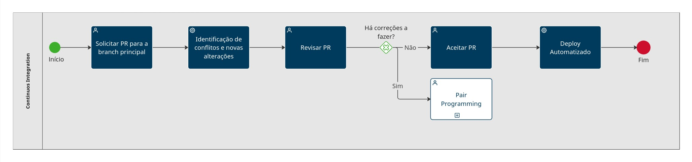

# 1.2. Módulo Processos/Metodologias/Abordagens

<!-- Foco_4: Metodologia (Modelagem BPMN & Escolhas Metodológicas)

Entrega Mínima: Modelagem BPMN, evidenciando algumas escolhas metodológicas utilizadas pela equipe nessa primeira entrega.

Apresentação (em sala) explicando o detalhamento metodológico desenhado, com: (i) rastro claro aos membros participantes (MOSTRAR QUADRO DE PARTICIPAÇÕES & COMMITS); (ii) justificativas & senso crítico sobre as escolhas metodológicas adotadas para o projeto; (iii) breve apresentação da modelagem em BPMN, e (iv) comentários gerais sobre o trabalho em equipe. Tempo da Apresentação: +/- 5min. Recomendação: Apresentar diretamente via Wiki ou GitPages do Projeto. Baixar os conteúdos com antecedência, evitando problemas de internet no momento de exposição nas Dinâmicas de Avaliação.

A Wiki ou GitPages do Projeto deve conter um tópico dedicado ao Módulo Processos/Metodologias/Abordagens, com modelagem BPMN, histórico de versões, referências, e demais detalhamentos gerados pela equipe nesse escopo.

Demais orientações disponíveis nas Diretrizes (vide Moodle). -->

## Introdução

Introdução do artefato aqui.

## Metodologias

Introdução aqui (se quiser).

### Scrum Adaptado

Explicar o que estamos usando do Scrum.

- Sprint Planning:
- Sprint:
- Sprint Review:

### XP Adaptado

Explicar o que estamos usando do Scrum.

- Pair Programming:
- Continuos Integration:

## Modelagem BPMN

### Introdução

O BPMN (Business Process Model and Notation) é uma notação gráfica utilizada para modelagem de processos de negócios. Ele serve como um padrão para representar visualmente os fluxos de trabalho e as etapas envolvidas nos processos empresariais e/ou de projetos, desde o início até a conclusão. O BPMN combina visualizações de processos, fluxos de trabalho, funcionalidades, organização e recursos com métricas subjacentes, como custos e tempos de ciclo. Sua finalidade é vincular a estratégia de negócios ao desenvolvimento de sistemas de TI, garantindo o valor do negócio. É uma ferramenta para modelar e otimizar processos de negócios, garantindo que as operações sejam eficientes e alinhadas aos objetivos da empresa.

### Legenda para o BPMN

A legenda para identificação dos símbolos utilizados no BPMN é apresentada na Figura 1 abaixo:

  
Figura 1 - Legenda BPMN.   (Fonte: Ana Rocha, Gabriel Zaranza e Jefferson França. 2024)

### Diagramas BPMN

As Figuras de 2 a 7 apresentadas abaixo, referem-se aos diagramas BPMN, que representam o fluxo dos principais processos identificados pela equipe, acerca do projeto.

<!-- BPMN GERAL -->

  
Figura 2 - BPMN Geral.   (Fonte: Ana Rocha, Gabriel Zaranza e Jefferson França. 2024)

<!-- SPRINT PLANNING -->

  
Figura 3 - BPMN Sprint Planning.   (Fonte: Ana Rocha, Gabriel Zaranza e Jefferson França. 2024)

<!-- SPRINT -->

  
Figura 4 - BPMN Sprint.   (Fonte: Ana Rocha, Gabriel Zaranza e Jefferson França. 2024)

<!-- PAIR PROGRAMMING -->

  
Figura 5 - BPMN Pair Programming.   (Fonte: Ana Rocha, Gabriel Zaranza e Jefferson França. 2024)

<!-- SPRINT REVIEW -->

  
Figura 6 - BPMN Sprint Review.   (Fonte: Ana Rocha, Gabriel Zaranza e Jefferson França. 2024)

<!-- CONTINUOS INTEGRATION -->

  
Figura 7 - BPMN Continuos Integration.   (Fonte: Ana Rocha, Gabriel Zaranza e Jefferson França. 2024)

## Conclusão

## Referências

- SERRANO, Milene. Slide "Notação BPMN". Disponível em: [Aprender 3](https://aprender3.unb.br/pluginfile.php/2790232/mod_label/intro/Arquitetura%20e%20Desenho%20de%20software%20-%20Aula%20BPMN%20Exemplos%20-%20Profa.%20Milene.pdf). Acesso em 04 abr. de 2024.  

## Histórico de Versão

| Versão | Data da alteração |             Alteração             |                   Responsável                   |                     Revisor                     | Data de revisão |
| :----: | :---------------: | :-------------------------------: | :---------------------------------------------: | :---------------------------------------------: | :-------------: |
|  1.0   |       04/04       |         Criação do Documento e Introdução BPMN       | [Gabriel Rosa](https://github.com/gabrielrosa09) | [Ana Rocha](https://github.com/anaaroch) | 05/04 |
|  1.0   |       05/04       |         Adição de tópicos e imagens BPMN       | [Ana Rocha](https://github.com/anaaroch) |||