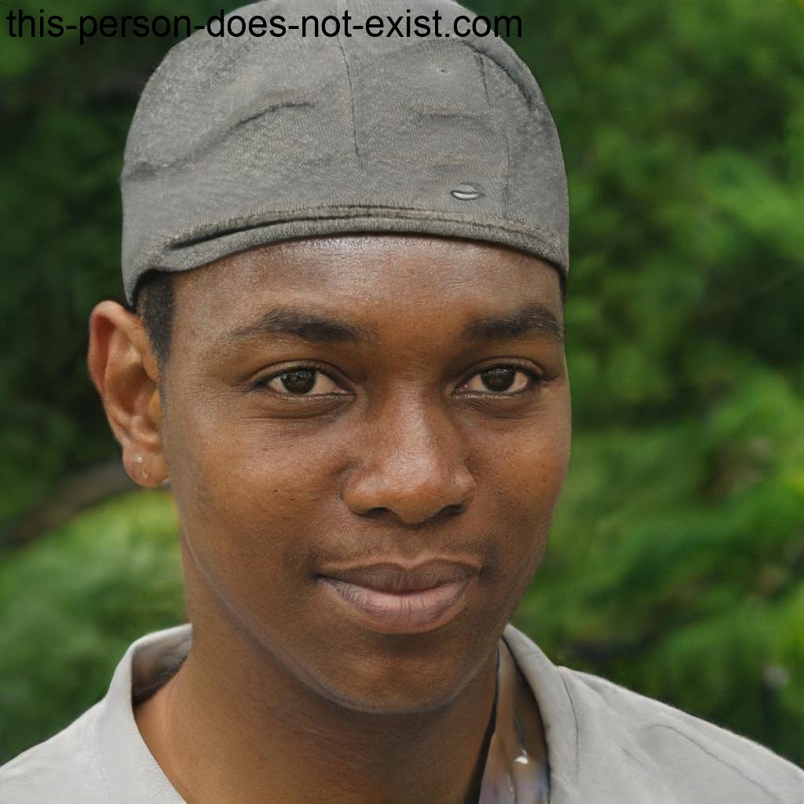

# Personas

## Introdução

As personas são como personagens fictícios elaborados para representar os diferentes tipos de usuários da aplicação. O objetivo é facilitar a compreensão das necessidades e comportamentos dos usuários, auxiliando assim na criação das funcionalidades do sistema. Essas personas devem ser construídas com características que representem os usuários comuns, mas também com detalhes específicos que as tornem úteis como ferramentas de design e comunicação.

## Objetivo

A criação de personas visa oferecer uma compreensão mais precisa dos usuários do sistema, ajudando as equipes de design e desenvolvimento a tomar decisões mais alinhadas às necessidades do público-alvo, resultando em um produto final mais intuitivo e relevante.

## Metodologia

A criação das personas foi baseada na análise dos dados fornecidos por um questionário, onde, foram identificados padrões e tendências que permitiram a criação de perfis dos usuários de serviços de streaming.

1- **Análise dos Dados do Questionário:** Analisar as respostas fornecidas pelos participantes do questionário. Isso incluiu examinar as respostas relacionadas à utilização de serviços de streaming, escolaridade, gênero, faixa etária, dispositivos utilizados, gêneros de conteúdo consumido e sugestões de melhorias para os serviços.

2- **Identificação de Padrões e Tendências:** Com base na análise dos dados, foram identificados padrões e tendências comuns entre os usuários de serviços de streaming. Isso incluiu padrões relacionados às preferências de gênero de conteúdo, dispositivos mais utilizados, faixa etária predominante e sugestões de melhorias mais frequentes.

3- **Segmentação dos Usuários:** Com base nos padrões identificados, os usuários foram segmentados em grupos que compartilhavam características semelhantes. Isso permitiu uma compreensão das necessidades e preferências específicas de cada grupo de usuários.

4- **Criação das Personas:** Com base nas segmentações e nas informações disponíveis, foram criadas quatro personas que representam diferentes perfis de usuários de serviços de streaming. Cada persona foi desenvolvida com base em características demográficas, comportamentais, necessidades, objetivos, expectativas e desafios específicos.

5- **Criação de Anti-Persona:** Além das personas, também foi criado uma anti-persona, representando os usuários que não se encaixam no público-alvo dos serviços de streaming ou que apresentam comportamentos e preferências que podem prejudicar a experiência do usuário. 

## Resultado

|Persona Primária 1||
|:---|:---|
| **Foto**|

Figura 1: Ana Silva

|
| **Nome**| Ana Silva|
| **Gênero**| Feminino|
| **Idade**| 23 anos|
| **Escolaridade**| Ensino Superior|
| **Habilidades**| Boa capacidade de navegação na internet, habilidade para análise de conteúdo audiovisual, organização.|
| **Tarefa Primária**| Assistir a filmes e séries em seu tempo livre para relaxar e se entreter.|
| **Objetivo**| Encontrar um serviço de streaming que ofereça um catálogo diversificado e de qualidade, sem interrupções por anúncios.|
| **Relacionamentos**| Vive em um apartamento com mais duas amigas e compartilha a assinatura de streaming com elas.|
| **Requisitos:**| Interface intuitiva, variedade de gêneros e títulos, ausência de anúncios, preço acessível.|
| **Expectativas**| Espera encontrar um serviço de streaming que atenda às suas preferências de conteúdo, oferecendo uma experiência fluida e agradável de navegação.|

 
 

|Persona Primária 2||
|:---|:---|
| **Foto**|

Figura 2: Lucas Oliveira

|
| **Nome**| Lucas Oliveira|
| **Gênero**| Masculino|
| **Idade**| 30 anos|
| **Escolaridade**| Ensino Superior|
| **Habilidades**| Conhecimento avançado em tecnologia, familiaridade com diferentes dispositivos eletrônicos, habilidade para análise crítica de mídia.|
| **Tarefa Primária**| Consumir conteúdo audiovisual, especialmente filmes de ficção científica e séries de ação.|
| **Objetivo**| Encontrar um serviço de streaming que ofereça uma ampla seleção de títulos em alta definição, sem restrições de qualidade.|
| **Relacionamentos**| Mora sozinho e utiliza o serviço de streaming como principal forma de entretenimento.|
| **Requisitos**| Qualidade de imagem e som impecáveis, opções de legendas e áudio em diferentes idiomas, catálogo diversificado.|
| **Expectativas**| Deseja uma experiência de streaming livre de problemas técnicos, com uma vasta biblioteca de conteúdo atualizado e clássicos.|

 
 

|Persona Secundária 1||
|:---|:---|
| **Foto**|

Figura 3: João Santos

|
| **Nome**| João Santos|
| **Gênero**| Masculino|
| **Idade**| 19 anos|
| **Escolaridade**| Ensino Médio|
| **Habilidades**| Boa adaptação a diferentes interfaces de usuário, familiaridade com dispositivos móveis.|
| **Tarefa Primária**| Assistir a filmes e séries durante o tempo livre, principalmente no celular.|
| **Objetivo**| Encontrar um serviço de streaming acessível que ofereça conteúdo variado e atualizado.|
| **Relacionamentos**| Divide o acesso ao serviço de streaming com a família.|
| **Requisitos**| Facilidade de acesso via dispositivos móveis, preço acessível, catálogo diversificado.|
| **Expectativas**| Espera encontrar um serviço de streaming que se adapte às suas necessidades e orçamento, proporcionando uma ampla variedade de opções de entretenimento.|

 
 

|Persona Secundária 2||
|:---|:---|
| **Foto**|

Figura 4: Sofia Garcia

|
| **Nome**| Sofia Garcia|
| **Gênero**| Feminino|
| **Idade**| 28 anos|
| **Escolaridade**| Mestrado|
| **Habilidades**| Boa capacidade de análise crítica, habilidade para pesquisa e descoberta de novos conteúdos, organização.|
| **Tarefa Primária**| Utilizar o serviço de streaming como fonte de aprendizado e entretenimento educativo.|
| **Objetivo**| Encontrar um serviço de streaming que ofereça uma ampla variedade de documentários e conteúdo educativo de qualidade.|
| **Relacionamentos**| Vive com o parceiro e compartilha o acesso ao serviço de streaming para assistir a conteúdos em conjunto.|
| **Requisitos**| Catálogo diversificado de documentários e conteúdo educativo, interface amigável, disponibilidade de legendas em diferentes idiomas.|
| **Expectativas**| Espera encontrar um serviço de streaming que atenda às suas necessidades de aprendizado e entretenimento, oferecendo uma seleção abrangente de documentários e conteúdo educativo de qualidade. Além disso, busca uma experiência de usuário intuitiva e sem interrupções.|

 
 

|Anti-Persona||
|:---|:---|
| **Foto**|

Figura 5: Carla Lima

|
| **Nome**| Carla Lima|
| **Gênero**| Feminino|
| **Idade**| 44 anos|
| **Escolaridade**| Ensino Superior|
| **Habilidades**| Resistência à mudança, preferência por métodos tradicionais de entretenimento.|
| **Tarefa Primária**| Consumir entretenimento de forma ocasional, preferencialmente através de canais de televisão convencionais.|
| **Objetivo**| Evitar aderir a serviços de streaming devido à complexidade percebida e ao custo adicional.|
| **Relacionamentos**| Casada e com filhos, prefere assistir a programas de TV em família.|
| **Requisitos**| Simplicidade de uso, custo baixo ou inexistente, familiaridade com o formato de TV tradicional.|
|**Expectativas**| Não se interessa por serviços de streaming devido à preferência por métodos de entretenimento mais convencionais e à percepção de complexidade e custo adicionais.|

 

## Referências Bibliográficas

> [1] BARBOSA, S. D. J.; SILVA, B. S. Interação Humano-Computador. Rio de Janeiro: Elsevier, 2011.
> 
> [2] This-Person-Does-not-Exist.com Dispónivel em: <https://this-person-does-not-exist.com/pt>.
> 

 

## Histórico de Versão

| Versão | Data da alteração |             Alteração             |                   Responsável                   |                     Revisor                     | Data de revisão |
| :----: | :---------------: | :-------------------------------: | :---------------------------------------------: | :---------------------------------------------: | :-------------: |
|  1.0   |       06/04/2024       |         Criação do documento        | [Catlen Cleane](https://github.com/catlenc) |[Luiz Gustavo](https://github.com/Luiz-GL-Campos)| 07/04/2024 |
|  1.1   |       07/04/2024       |         Correções do artefato       | [Catlen Cleane](https://github.com/catlenc) |[Luiz Gustavo](https://github.com/Luiz-GL-Campos)| 07/04/2024 |
|  1.2   |       07/04/2024       |         Alteração nas tabelas       | [Ana Beatriz](https://github.com/anabfs) |||
