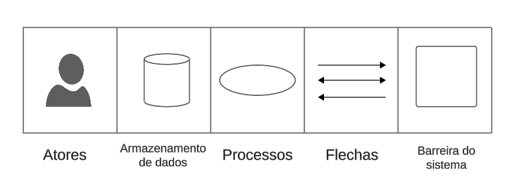
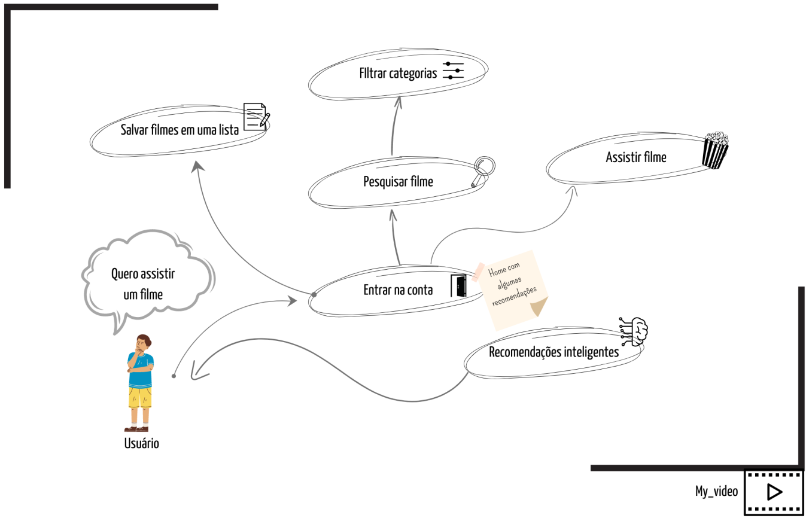
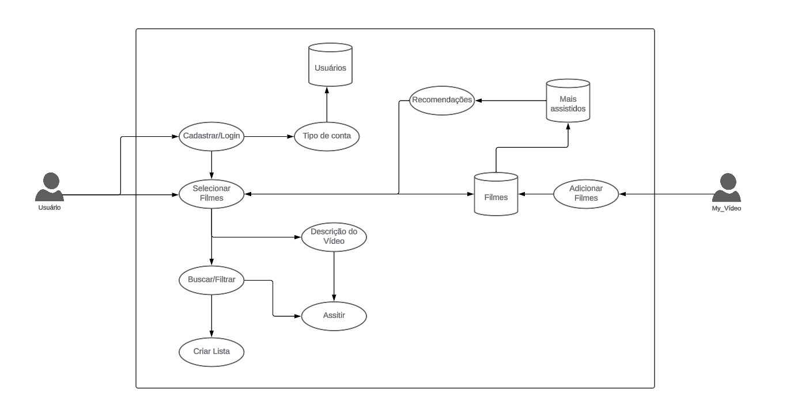

# **Rich Picture**

## Introdução

O Rich Picture é uma ferramenta visual que permite expressar o entendimento que se tem sobre o negócio, e como funciona todo o processo que será desenvolvido. Nesse sentido, a fim de desenvolver um entendimento comum entre o grupo, sobre o nosso projeto (My Video), elaboramos os seguintes artefatos:

## Metodologia

Para criar um rich picture, é fundamental incluir componentes essenciais, conforme ilustrado na Figura 1. Esses componentes são os seguintes: Atores, Processos, Setas, Armazenamento de Dados e a Fronteira.

Ao incorporar esses componentes em um rich picture, é possível criar uma representação visual abrangente e compreensível do sistema em questão, facilitando a análise e a comunicação sobre sua funcionalidade e interações.

<b>Figura 1:</b> Legenda Rich Picture

<b>Fonte: </b><a href="https://github.com/Frans6">Jefferson França</a>, 2024

## Resultado

Nas figuras 2 e 3, foram desenvolvidos os seguintes Rich Pictures representado os conceitos proprostos pela técninca.

<b>Figura 2:</b> Rich Picture 1

<b>Fonte: </b><a href="https://github.com/lucaslobao-18">Lucas Lobão</a>, 2024

<b>Figura 3:</b> Rich Picture 2

<b>Fonte: </b><a href="https://github.com/Frans6">Jefferson França</a>, 2024

## Referências

> [1] Rich Picture. Wiki Arquitetura e Desenho de Software - Projeto Americanas - Grupo 4. Disponível em: https://unbarqdsw2023-2.github.io/2023.2_G4_ProjetoAmericanas/#/Base/richPicture. Acesso em: 05 abril de 2024.

> [2] Rich Picture. Wiki Arquitetura e Desenho de Software - Projeto MAgazine Luiza - Grupo 8. Disponível em: https://unbarqdsw2023-2.github.io/2023.2_G8_ProjetoMagazineLuiza/#/./Base/RichPicture. Acesso em: 07 abril de 2024.

## Histórico de Versão

| Data  | Atividade                 | Autor             | Revisor      |
| ----- | ------------------------- | ----------------- | ------------ |
| 05/04 | Criação do documento      | Lucas e Jefferson | Ana Caroline |
| 07/04 | Adicionando Rich Pictures | Lucas e Jefferson | Ana Caroline |