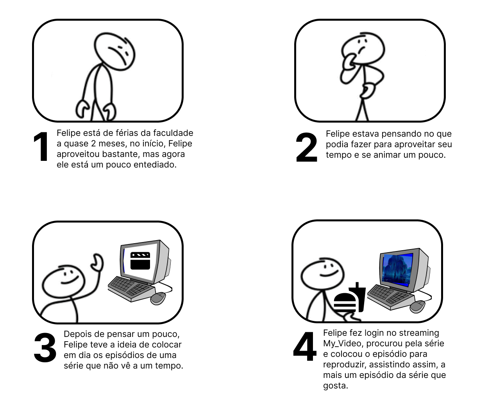
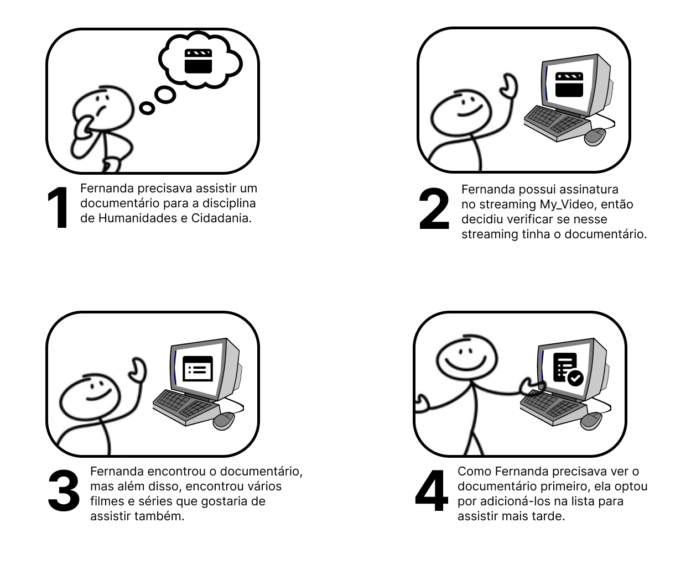
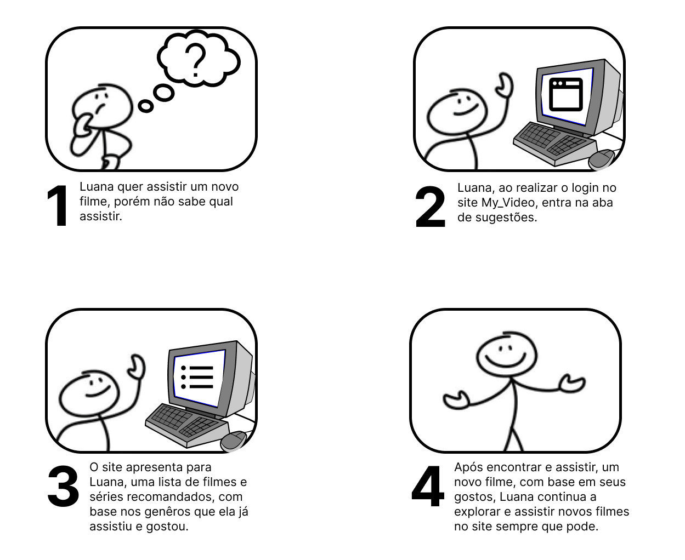
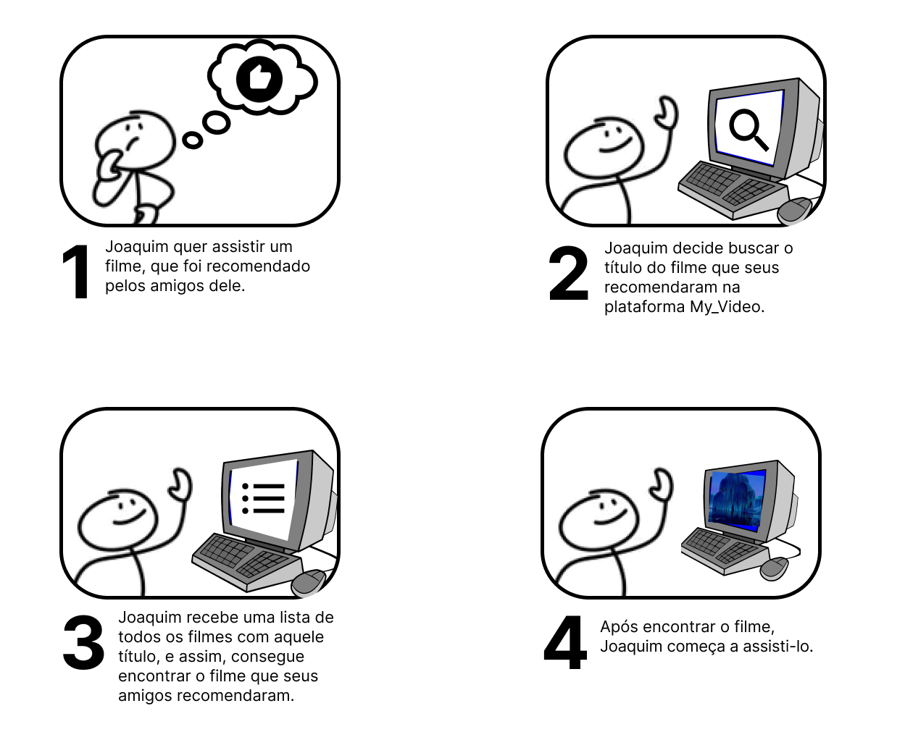

# Storyboard

## Introdução

O Storyboard é uma técnica de prototipação que permite uma representação simplificada das interações do usuário em determinada plataforma. Este documento tem como objetivo registrar os Storyboards desenvolvidos para a My_Video, plataforma de streaming de filmes, séries e documentários, fornecendo insights sobre os fluxos do usuário dentro da plataforma de streaming.

## Finalidade do Artefato

Este artefato visa analisar as interações do usuário descritas nos Storyboards, com o intuito de otimizar os fluxos antes da prototipagem ou implementação. 

## Storyboards

A seguir estão os storyboards desenvolvidos para a plataforma My_Video, numerados de 1 a 4:

A Figura 1 é referente ao Storyboard onde o usuário realiza a tarefa de assistir a um filme na plataforma My_Video.

  

  
Figura 1 - Storyboard - Assistir. (Fonte: Ana Rocha. 2024)

A Figura 2 apresenta o Storyboard onde o usuário executa a tarefa de adicionar um filme na lista "Assistir Depois".

  

  
Figura 2 - Storyboard - Adicionar à lista. (Fonte: Ana Rocha. 2024)

A Figura 3 corresponde ao Storyboard em que o usuário recebe sugestões de filme e série da própria plataforma My_Video, com base em filmes e séries já assistidos e bem avaliados pelo usuário.

  

  
Figura 3 - Storyboard - Sugestão. (Fonte: Luiz Gustavo. 2024)

A Figura 4 refere-se ao Storyboard em que o usuário realiza uma busca por um título na plataforma My_Video.

  

  
Figura 4 - Storyboard - Buscar. (Fonte: Luiz Gustavo. 2024)

## Conclusão

Conclusão aqui.

## Histórico de Versão

| Versão | Data da alteração |             Alteração             |   Autor(es)   |           Revisor(es)       | Data de revisão |
| :----: | :---------------: | :-------------------------------: | :---------------------------------------------: | :---------------------------------------------: | :-------------: |
|  1.0   |       04/04/2024       |         Criação do documento        | [Ana Rocha](https://github.com/anaaroch) e [Luiz Gustavo](https://github.com/Luiz-GL-Campos) |  |  |