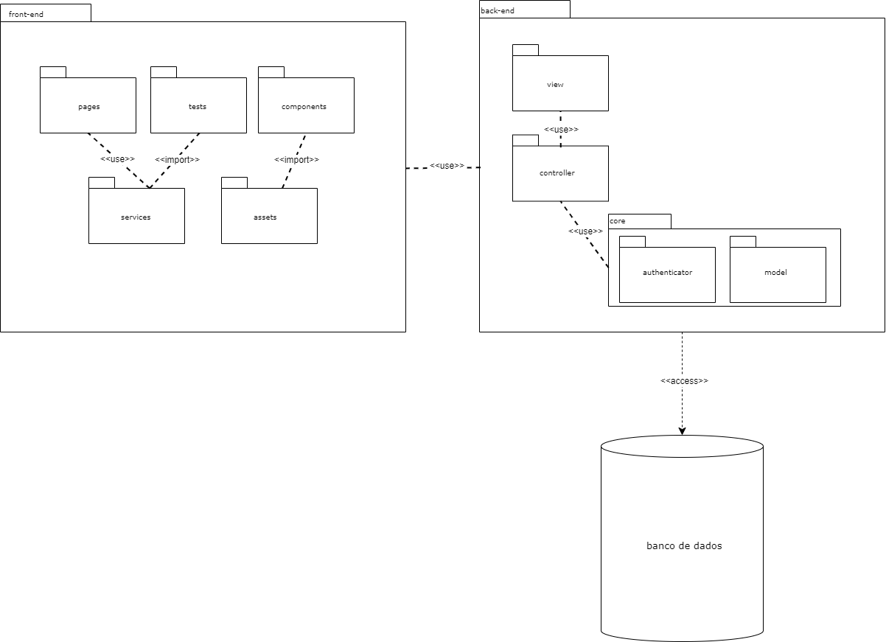
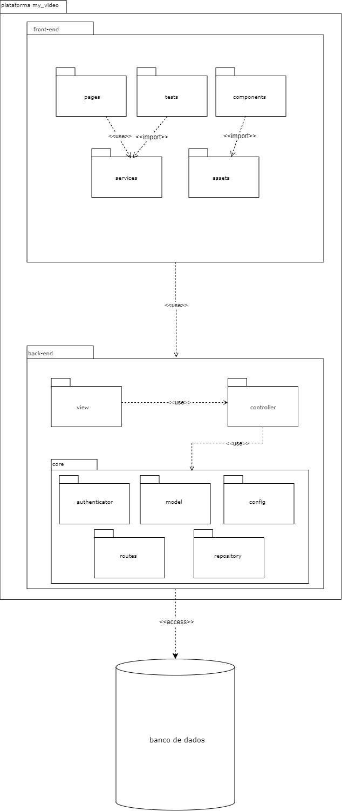

# Diagrama de Pacotes

## Introdução

Os diagramas de pacotes são ferramentas estruturais utilizadas para exibir a organização e a disposição de diversos elementos de modelos na forma de pacotes. Esses pacotes agrupam elementos relacionados do UML, como diagramas, documentos, classes e até outros pacotes, organizando-os de forma hierárquica. Cada elemento dentro do pacote é representado como uma pasta de arquivo no diagrama. Embora sejam estáticos, esses diagramas possuem um viés organizacional, permitindo uma visão modular do sistema. São frequentemente usados para proporcionar uma organização visual em camadas da arquitetura de qualquer classificador UML, como em sistemas de software.

## Metodologia

A metodologia utilizada neste estudo começou pelo <a href="https://unbarqdsw2024-1.github.io/2024.1_G4_My_Video/#/Base/brainstorming">brainstorming</a> realizado pelo grupo anteriormente para identificar os principais requisitos e funcionalidades necessárias para um site de streaming. A partir desse documento, elaboramos um diagrama de pacotes representativo, seguindo as melhores práticas de engenharia de software descritas por <a href="https://www.amazon.com.br/Engenharia-Software-Abordagem-Roger-Pressman/dp/8581437592">Pressman (2016)</a>.

Para construir o diagrama, escolhemos a plataforma do <a href="https://www.draw.io/">Draw.io</a> por ser gratuita, possuir integração com a modelagem UML e ser de fácil compartilhamento.

## Diagrama
### Primeira Versão

#### 
Figura 1: Diagrama de Pacotes - Primeira Versão (Fonte: Ana Beatriz, Breno Yuri) 

### Segunda Versão

#### 
Figura 2: Diagrama de Pacotes - Segunda Versão (Fonte: Ana Beatriz, Breno Yuri) 

## Referências

> [1] LUCIDCHART. O que é um diagrama de pacotes UML? Disponível em: [Lucidchart](https://www.lucidchart.com/pages/pt/diagrama-de-pacotes-uml#:~:text=um%20diagrama%20UML-,O%20que%20é%20um%20diagrama%20de%20pacotes%20UML%3F,ou%20até%20mesmo%20outros%20pacotes). Acesso em: 8 jul. 2024.

> [2] Pressman, R. S. (2016). Engenharia de Software: Uma Abordagem Profissional. McGraw-Hill.Disponível em: [Internet Archive](https://archive.org/details/pressman-engenharia-de-software-uma-abordagem-profissional-8a/page/n19/mode/2up). Acesso em: 02/07/2024

## Histórico de Versão

| Versão | Data da alteração |             Alteração             |   Autor(es)   |           Revisor(es)       | Data de revisão |
| :----: | :---------------: | :-------------------------------: | :---------------------------------------------: | :---------------------------------------------: | :-------------: |
|  1.0   |       08/07/2024       |         Criação do documento        | [Breno Yuri](https://github.com/YuriBre) | |  |
|  1.1   |       09/07/2024       |         Adição dos diagramas        | [Ana Beatriz](https://github.com/anabfs) | |  |