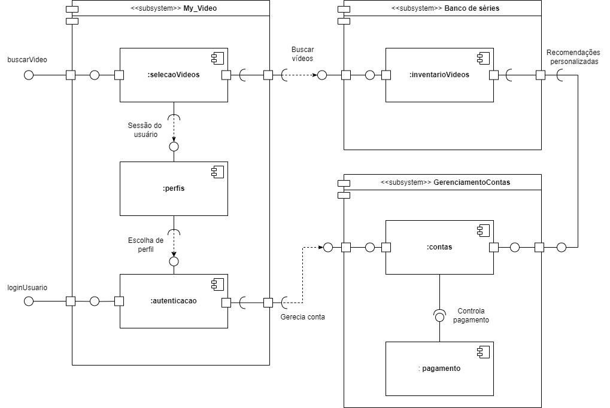

# Diagramas de Componentes

## Introdução

O diagrama de componentes é um diagrama da <a href="https://www.uml-diagrams.org/">UML</a> que mostra o relacionamento e a interação entre diferentes componentes do projeto. Um componente pode ser compreendido como um sistema ou um subsistema independente, que são capazes de interagir com outros componentes e formar um sistema maior.

## Objetivo

Este tipo de diagrama é bastante utilizado no desenvolvimento baseado em componentes (CBD) e tem o objetivo de fornecer uma visão geral do sistema de software, identificando os componentes e suas interfaces fornecidas e assim, descrevendo um sistema de software.

Um diagrama de componentes é essencial para a arquitetura de sistemas complexos, pois facilita a visualização da organização e das dependências entre os diferentes módulos. Este tipo de diagrama ajuda a identificar claramente os componentes do sistema, as interfaces que eles expõem e as relações entre eles, promovendo uma melhor compreensão e comunicação entre os membros da equipe de desenvolvimento.

## Metodologia

Para contruir o diagrama, escolhemos a plataforma do <a href="https://www.draw.io/">Draw.io</a> por ser gratuita, possuir integração com a modelagem UML e ser de fácil compartilhamento.

## Diagrama

#### 
Figura 1: Diagrama de Componentes (Fonte: Caio Santos, Luiz Campos, Jefferson França) 

## Referências

> [1] UML Component Diagrams. Disponível em: <https://www.uml-diagrams.org/component-diagrams.html>. Acesso em: 22 de abril de 2024.

> [2] Diagrama de componentes UML: o que é, como fazer e exemplos. Disponível em: <https://www.lucidchart.com/pages/pt/diagrama-de-componentes-uml>. Acesso em: 22 abril de 2024.

## Histórico de Versão

| Versão | Data  |           Atividade           |                    Autor(es)                     | Revisor(es) | Data de Revisão |
| :----: | :---: | :---------------------------: | :----------------------------------------------: | :---------: | :-------------: |
|  1.0   | 22/04 |     Criação do documento      |  [Caio Santos](https://github.com/caiobsantos)   |  [Ana Beatriz](https://github.com/anabfs)           |      08/07/2024           |
|  1.1   | 25/04 |      Adição do diagrama       |  [Caio Santos](https://github.com/caiobsantos)   |  [Ana Beatriz](https://github.com/anabfs)           |        08/07/2024         |
|  1.2   | 08/07 | Correção de caminho da imagem | [Luiz Campos](https://github.com/Luiz-GL-Campos) |  [Breno Yuri](https://github.com/YuriBre)   |  08/07/2024    
|  1.3   | 08/07 |        Adição de Texto        |  [Jefferson França](https://github.com/Frans6)   |     [Breno Yuri](https://github.com/YuriBre)          |      08/07/2024                |
