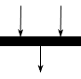
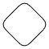

# Diagrama de Atividades

## Introdução

No contexto da plataforma My_Video, os diagramas de atividades visam capturar e visualizar o fluxo de operações e processos essenciais. Este artefato de modelagem UML é projetado para representar de maneira clara e sequencial as atividades executadas dentro do sistema, de forma a destacar a ordem das ações e as condições que influenciam seu fluxo.

## Metodologia

Os diagramas de atividades são desenvolvidos para descrever desde o início até a conclusão das principais tarefas da plataforma, como reprodução de conteúdo e recomendações personalizadas. Essa representação não apenas ilustra a lógica e o sequenciamento das operações, mas também facilita a comunicação entre as equipes de desenvolvimento e os stakeholders de negócios, garantindo uma compreensão comum dos processos da plataforma.
Em resumo, os diagramas de atividades UML não só modelam o comportamento operacional do sistema, mas também promovem uma melhor compreensão e colaboração na implementação e evolução contínua da plataforma.

## Legenda dos Símbolos Utilizados

Na tabela 1 abaixo, estão identificados os símbolos que foram utilizados no Diagrama de Atividades desenvolvido:

| Símbolo | Nome | Descrição |
| :-----: | :--: | :-------: |
|  | Símbolo de início | Representa o começo de um processo ou fluxo de trabalho. |
|  | Símbolo de atividade | Indica as atividades que compõem um processo modelado. |
|  | Símbolo de junta | Combina duas atividades simultâneas e as reintroduz em um fluxo onde apenas uma atividade ocorre por vez. |
|  | Símbolo de decisão | Representa uma decisão e sempre tem pelo menos dois caminhos ramificados e com texto de condição, permitindo aos usuários visualizarem opções. |
|  | Símbolo de final de fluxo | Representa o final de um fluxo de processo específico. |
|  | Símbolo de término | Marca o estado final de uma atividade e representa a conclusão de todos os fluxos de um processo. |

  
Tabela 1 - Legenda de Símbolos do Diagrama de Atividades. (Fonte: Ana Rocha e Gabriel Rosa. 2024)

## Diagrama

No diagrama 1 abaixo estão sendo representados os fluxos de buscar, assistir, avaliar e adicionar à "ver depois" em um diagrama de atividades. Com isso, separamos em duas colunas uma de usuário e outra de sistema. Primeiramente, o usuário faz o login, o sistema valida o login, posteriormente o usuário faz uma buscar por filmes/séries e selecionar um para assistir, e o sistema exibi todos os resultados da busca. Neste momento, o usuário tem uma decisão para fazer e se vai assistir agora ou adicionar em "ver depois". Caso opte em "ver depois", o sistema confirma a adição na lista e finaliza a atividade, caso contrário o sistema irá reproduzir o filme. Após o término do filme/série, o usuário tem a opção de avaliar, caso ele opte em avaliar, o sistema registra sua avaliação e sugere outros filmes/séries e finaliza a atividade, caso contrário o usuário não avalie, a atividade é finalizada direto.

<iframe allowfullscreen frameborder="0" style="width:700x; height:700px" src="https://viewer.diagrams.net/?lightbox=1&highlight=0000ff&nav=1&title=Diagrama%20sem%20nome.drawio#R%3Cmxfile%20pages%3D%223%22%3E%3Cdiagram%20name%3D%22Diagrama%20v.1%22%20id%3D%220783ab3e-0a74-02c8-0abd-f7b4e66b4bec%22%3E7Vxbc5s4FP41nmkfkuFqzGPsJO222W2n3t2m%2ByaDgtUC8nJJ7P76lUBcJWzsYIO7zkwSJISEzjn6dG5ipM689bsArJa%2FYxu6I0Wy1yP1dqQosjrWyD9as0lrDN1MK5wA2axRUTFHPyGrlFhtjGwYVhpGGLsRWlUrLez70IoqdSAI8Eu12RN2q6OugAO5irkFXL72K7KjZVo70aWi%2Fj1EzjIbWZbYnQWwfjgBjn02no99mN7xQNYNaxougY1fSlXq3UidBRhH6ZW3nkGXkjWjWPrcfcPd%2FJUD6EetHrBkWzM1S5YnY0m17SvWwzNwY0aGaRxaIBgpM1J9E4YojFBWIq1QfstGFsI%2BLUqjmTq6keiFMv43pnOZPkN6w4YrjMKilhEh2mQ0D1%2BQ5wJCLnW6jDyXVMrk0loi134AGxzTSYURoW9WmpJSEDHhIQOq04TwkM6PlnIC04KFPWSxaxcsoDvNOTXDLg7IrYRXtNcA%2F8jZTt%2FhCfvRPfCQS6X5bxjYwAesmo0uE%2B5NCUUcnxQswgAy5WyKZY5kJIZBBNelKsahdxB7MAo2pMm6uiDYOspk56UklKqe1i1LAmmOWUPAFoKT91xIBLlgQiEWEOvjD%2Fdh4Xx4eP76%2BPj%2B9qt7Y%2F%2B4MlSOcdAma4cVcRAtsUNkwb0ramt8Kdo8YLxiNP4Oo2jDqAniCFelAK5R9Fi6%2Fka7utZZ6XbNek4KG1YQUL9B4kMcBxabzFjSDRko0oT8lQxVvpow%2BAGBA5v6YRyghNjK1AC6IELPVZDpnkU6t5D74Nlh9BfPSOGZIG6oDYoTsqT92qtFOGtTsGQayKMOi12KcS7sIlwKNo%2FlQukpWiweS0pHYLOsqG35rIz74jM3O4XDxr%2FCOFFa5ADhlkoJp3i0J2uLrb95r9dk0V6vdbDXc9ue1mIPcV2ij1PSvCxRBOcrkMjLCzEJquQ6llqGXDdrNFJUKfnpVl1rkp7W%2BptW1d9UAU8lnqVdcFS8P8o8F08HcAWofSvd2QVwBaZ9q0DawQCXSfKeWt9WzaQ7ZGOPfsaITKCwAyZVQZKNmoikb8qeqklJ%2FhqHQcGEg4IH7CCfk6RCTuTdmHAc4%2Bw9dJ9hhKxW6x0EVnafDmyDcFmAVDJONrgNn0DsMluWdu%2FesM4iugSSofi2ZXwqao%2BBMrKmV2FG52Am91CUcUbtAGf4t3%2B9ElWSk13iQDbiG%2BrwqdXdI%2FrCjJXFZp1CiZ09YbkgDJH155JIc3KDPSanpdJDAoATAuGBzoNuQEvjQatpMQ9E457wPqc%2BNqjD6P9KU7U3nXjrewu8f1KY6MdmgCDpmqCaBy%2FYP1jsz4H%2BFOAvtv97dREepmR2bkW3xotxS7wwO9c0X4cXYw4v5tCFeRwg9t6AtxfsGDp2NFgVZeyQT2mgmmaf2HGYB%2B4UBupWSNiNHcagsEOWenVD%2FLJcHpZun713aYcoB4oB%2BXURMc5G1DusplAKU%2FgaFeFiCcelBiAPQkvAwQGB63t%2BO1libxGHtDsUQCsiA5IbhMwU0abVzaaM9fsZAnuArFpV0BRdALKKAGQnHYCs9%2B7F%2BW5of83mq8icf1o%2Fh1e%2FXWVe5HNS0Ppbfga%2F%2FMRUHVbsMXvvLctv7xSNi6bWl6am1uIIp1TUph9n4J9v5nL22Yz155%2BfjMcvH67OMJDQm423R0B8YFs47%2Fq%2Fqe%2FAF4wYCkYo9ShAW5A4mieIzOX8YKI3TSNf%2FTtVDa1ze64h6mhWJUrPNMcdUUeuo7poavXwZUqcLsKXDYJockj2R%2BKZUvmcD0rVB4o%2FVanikKOOAh6y7VSAYYh%2BgkXSH5WRFZ1WMlF9OtJvhVKzff2wPGfW5yjPDWkPDtK1TGyoKj6kpUNlJGuCn55CeByu5anSFz9BmyyrzrPpxItZlarK6Fg6EBXqHenyiVFB4cOPc%2BQNGRCyFfF6QLiSrqVJFvVjDLgaPiRIvEp6C0P4ndqzIDuUQK3be1zyGwmiEGfgOeJ2TU2Q1yFS6I7mOdJ6zWc%2BSJ%2BTezP7hAmyvepzHHKP2yF3d4Crcqs3P0l0sSMHakfqk5aw04UdKV4f52hGKidQBIXUUjs%2FjiRGk0ltdzJrYNKgvd0EAdiUmjFlqO0wY712rLFus2rqtvbkIn2BQ4Ftq%2B9%2FWx4bwagVvQxj7y7PnF%2FBAJHBKYLcsnz6z0VVWRqLk6Wf4shFPhztm7vWHgHGDdb6CdLWt0r0NvL%2BGmcQAhwBpnfuhwp7xCOVqhJgjHl4NwXcrRtn3aF7rzkfB6K7cQIv4VZdsYdt4HVc5uOR5wyRddfoWOdX0bEwkkvqbgGPGWm9tUM%2F2XC9WHn%2BNass0zBTSRN%2Fx2ccIoZGCxxF2GtGSAJ%2BT8lPo1q7g484ZxmkH0%2BYhhtvgelbkdse8kHEr%2FpGFD%2FqEf7OM3YnAgA%2B6faq9%2Bpm3QeAO8TRDB63npboDUK5afEK5hyFEfT4AGwfR1az045yLdVJoDeKMp22HmFlo32h7k7fcWExnF5zZ4iGE41WDz4Blyx2ijBTKtMhx6f9DISmr0OUWPc3wRk7cVS6l5N0x%2FR9aPtKsKwb1%2F2dpdv6TYuS%2FNyt0SJJwQhgSGhB%2BE8zJW3qA1%2FQQzsXgRqQQCk1gTJbetOOlmOff3ajJFFf4CrAdvwzkarLmY2zEihVoD8eTaLEtt0ZxulHXYeFstDY7rCQ4MiXWEUdVjZg%2FuIV3HCIGhokukwayUmww2jKrbngRl%2B4YdT8FcJjornyc5KwjsynX8yw%2F4QCLw3i2%2BgiTMMUJllXr416ckL%2FAqXyySHz2IFBotX4%2BBmEb3D4dqSME8IsSO3YST4kmSs8YabxhBdpG4y0KZxRpp9SiRaef%2BA9rP8%2Fjaf1BwFbH6GSu1Z4Doo458egM2iTd4Sc6%2B2Zg7epvWa%2Bsr1Rab9vSJsUi68Mp82Lrzird%2F8B%3C%2Fdiagram%3E%3C%2Fmxfile%3E" id="Tw9Ri8pKpHV."></iframe>

  
Diagrama 1 - Fluxos principais. (Fonte: Ana Rocha e Gabriel Rosa. 2024)

## Artefato Relacionado

O artefato [Storyboard](/Base/storyboard.md) também aborda os principais fluxos destacados nos diagramas acima, o mesmo foi desenvolvido na etapa anterior deste projeto, onde é representada de forma básica as interações dos usuários na plataforma: 

- [Storyboard 1](/Base/storyboard.md#figura1): Representa o fluxo onde o usuário assiste a um filme na My_Video.
- [Storyboard 2](/Base/storyboard.md#figura2): Mostra como o usuário adiciona um filme à lista "Assistir Depois".
- [Storyboard 3](/Base/storyboard.md#figura3): Ilustra as sugestões de filmes e séries baseadas nos gostos do usuário.
- [Storyboard 4](/Base/storyboard.md#figura4): Detalha o processo de busca por um título específico na plataforma.

## Conclusão

O diagrama de atividades como descrito no documento é uma ferramenta para modelar e compreender as ativades e processos de um sistema, sendo representado de uma forma visual e isso pode ser um grande facilitador para simplicar a comunicação e identificar áreas de melhoria no sistema. De modo geral, a dupla pôde compreender de forma clara a importância de representar os processos de um software de maneira visual para uma melhor compreensão do sistema. 

## Referências

- SERRANO, Milene. Slide "MODELAGEM UML DINÂMICA". Disponível em: [Aprender 3](https://aprender3.unb.br/pluginfile.php/2790248/mod_label/intro/Arquitetura%20e%20Desenho%20de%20Software%20-%20Aula%20Modelagem%20UML%20Din%C3%A2mica%20-%20Profa.%20Milene.pdf). Acesso em 07 jun. de 2024.  
- FAKHROUTDINOV, Kirill. Postagem "Activity Diagrams". Disponível em: [UML Diagrams Org](https://www.uml-diagrams.org/activity-diagrams.html). Acesso em 07 jun. de 2024.  
- SOFTWARE, Lucid. Página "O que é diagrama de atividades UML?". Disponível em: [Lucidchart](https://www.lucidchart.com/pages/pt/o-que-e-diagrama-de-atividades-uml). Acesso em 07 jun. de 2024.  

## Histórico de Versão

| Versão | Data da alteração |             Alteração             |   Autor(es)   |           Revisor(es)       | Data de revisão |
| :----: | :---------------: | :-------------------------------: | :---------------------------------------------: | :---------------------------------------------: | :-------------: |
|  1.0   |       02/07/2024       |         Criação do documento        | [Ana Rocha](https://github.com/anaaroch) |  |  |
|  1.1   |       07/07/2024       |         Adição do diagrama e legenda de símbolos        | [Ana Rocha](https://github.com/anaaroch) |  |  |
|  1.2   |       07/07/2024       |         Adição da conclusão e introdução dos diagramas | [Gabriel Rosa](https://github.com/gabrielrosa09) |  |  |