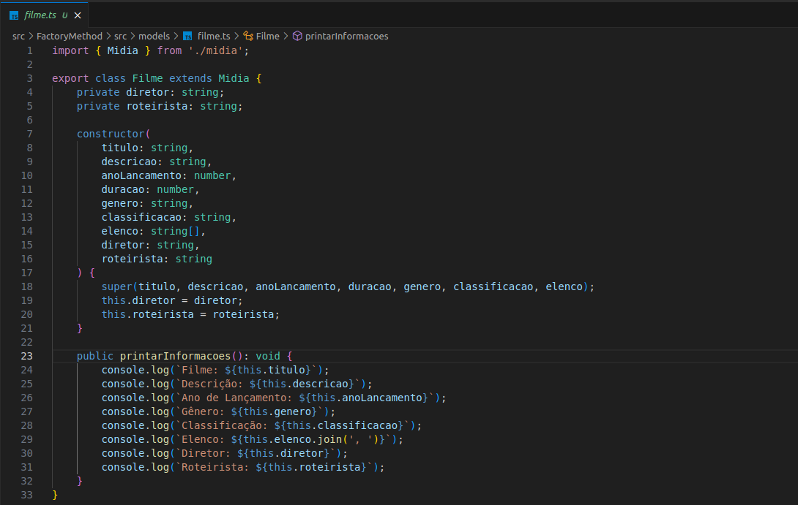

# Factory Method

## Introdução

O Factory Method é um padrão de projeto criacional do GOF que define uma interface para criar objetos em uma superclasse, permitindo que subclasses alterem o tipo de objetos criados. Ele promove a reutilização de código centralizando a criação dos objetos em um único método, tornando o código mais modular e fácil de modificar. Seu principal objetivo é delegar a responsabilidade da criação de objetos às subclasses, útil quando o processo de criação é complexo ou depende de uma configuração específica.

## Metodologia

**1. Definir a Interface do Produto:** Criar uma interface ou classe abstrata que define o tipo de objeto a ser criado.

**2. Criar Produtos Concretos:** Implementar a interface do produto em uma ou mais classes concretas.

**3. Definir a Classe Criadora:** Criar uma classe abstrata ou interface que declara o Factory Method.

**4. Implementar Criadores Concretos:** Implementar classes concretas que sobrescrevem o Factory Method para criar instâncias específicas dos produtos concretos.

**5. Utilizar o Factory Method:** Usar os criadores concretos para criar produtos sem se preocupar com a classe específica do produto.

## Factory Method

### 1. Aplicação

   

### 2. Modelagem

   

### 3. Código

Para acessar a implementação em código do Factory Method, basta clicar [aqui](https://github.com/UnBArqDsw2024-1/2024.1_G4_My_Video/tree/main/src/FactoryMethod). Nesta pasta podemos encontrar todos os arquivos que irão servir de base para o Factory Method, assim como serão mostrados nesse documento.

Os códigos foram desenvolvidos em TypeScript e estão organizados em três tipos principais de arquivos: factories, models e principal.

- **Factories:** Os arquivos deste tipo implementam o padrão de projeto Factory Method, que é utilizado para criar objetos sem especificar a classe exata do objeto a ser criado. Eles contêm as interfaces e as implementações concretas das fábricas, que são responsáveis por instanciar objetos das classes de modelo apropriadas.
- **Models:** Os arquivos deste tipo definem as classes de modelo usadas na aplicação. Estas classes representam os dados e comportamentos dos objetos que serão criados pelas fábricas.
- **Principal:** O arquivo principal.ts contém o código principal que utiliza as fábricas para criar e manipular objetos das classes de modelo. Este arquivo é responsável por testar a implementação do padrão Factory Method e verificar se as instâncias das classes são criadas e manipuladas corretamente.

Cada um desses arquivos é crucial para a implementação e o entendimento do padrão Factory Method, oferecendo uma visão clara de como o padrão é aplicado para criar e gerenciar instâncias de objetos na aplicação, como podemos ver nas figuras 1-10:

#### Factories:

- midia-factory.ts:

  
Figura 1 - Midia Factory. (Fonte: Ana Rocha. 2024)

- filme-factory.ts:

  
Figura 2 - Filme Factory. (Fonte: Ana Rocha. 2024)

- serie-factory.ts:

  
Figura 3 - Serie Factory. (Fonte: Ana Rocha. 2024)

#### Models:

- filme.ts:

  
Figura 4 - Filme Model. (Fonte: Ana Rocha. 2024)

- serie.ts:

  
Figuras 5 e 6 - Serie Model. (Fonte: Ana Rocha. 2024)

- episodio.ts:

  
Figura 7 - Episodio Model. (Fonte: Ana Rocha. 2024)

- temporada.ts:

  
Figura 8 - Temporada Model. (Fonte: Ana Rocha. 2024)

#### Principal:

- principal.ts:

  
Figuras 9 e 10 - Função Principal. (Fonte: Ana Rocha. 2024)

### 4. Saída do Código

Após a execução do código principal, a saída obtida é ilustrada na figura 11:

  
Figura 11 - Saída do Código. (Fonte: Ana Rocha. 2024)

## Conclusão

## Referências

- SERRANO, Milene. Slide "MODELAGEM UML DINÂMICA". Disponível em: [Aprender 3](https://aprender3.unb.br/pluginfile.php/2790248/mod_label/intro/Arquitetura%20e%20Desenho%20de%20Software%20-%20Aula%20Modelagem%20UML%20Din%C3%A2mica%20-%20Profa.%20Milene.pdf). Acesso em 06 jul. de 2024.  
- FIGUEIREDO, Eduardo. Postagem "Diagrama de Comunicação". Disponível em: [UML Diagrams Org](https://homepages.dcc.ufmg.br/~figueiredo/disciplinas/aulas/uml-diagrama-comunicacao_v01.pdf). Acesso em 06 jul. de 2024.  

## Histórico de Versão

| Versão | Data da alteração |            Alteração             |                                           Autor(es)                                           |                                                                   Revisor(es)                                                                    | Data de revisão |
| :----: | :---------------: | :------------------------------: | :-------------------------------------------------------------------------------------------: | :----------------------------------------------------------------------------------------------------------------------------------------------: | :-------------: |
|  1.0   |    22/07/2024     |       Criação do documento       | [Lucas Lobão](https://github.com/lucaslobao-18) e [Catlen Cleane](https://github.com/catlenc) | [Ana Rocha](https://github.com/anaaroch) | 24/07/2024 |
|  1.1   |    24/07/2024     |       Código e saída do código       | [Ana Rocha](https://github.com/anaaroch) | [Breno Yuri](https://github.com/YuriBre) | 24/07/2024 |
