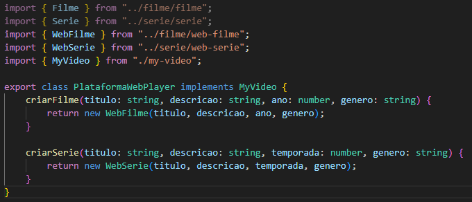
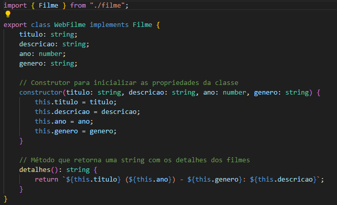
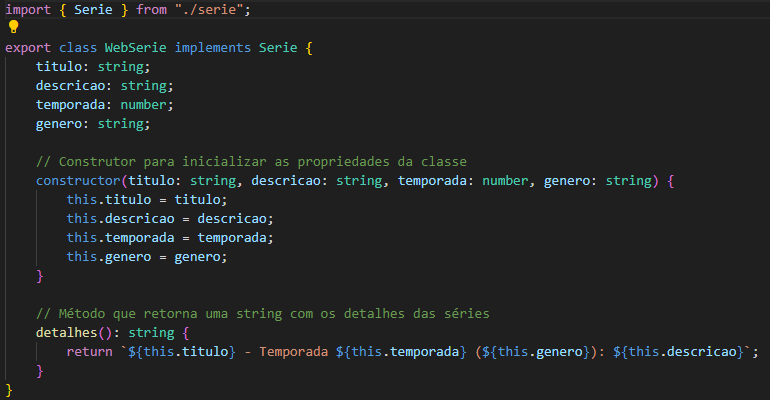
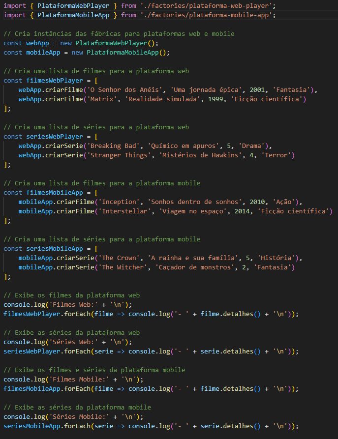

# Abstract Factory

## Introdução

O padrão de projeto Abstract Factory é um padrão criacional que fornece uma interface para criar famílias de objetos relacionados ou dependentes sem especificar suas classes concretas. Ele permite que você crie conjuntos de objetos que funcionam bem juntos, promovendo a consistência e a intercambiabilidade dos objetos criados. Este padrão é útil quando você precisa criar várias famílias de produtos ou objetos e deseja garantir que os objetos de uma família sejam compatíveis entre si.

## Metodologia

**1. AbstractFactory (Fábrica Abstrata):** Declara um conjunto de métodos para criar cada um dos produtos abstratos. Esses métodos são geralmente abstratos ou implementados por classes derivadas.

**2. ConcreteFactory (Fábrica Concreta):** Implementa os métodos da AbstractFactory para criar instâncias de produtos concretos.

**3. AbstractProduct (Produto Abstrato):** Declara uma interface para um tipo de produto. Todas as variantes do produto devem implementar essa interface.

**4. ConcreteProduct (Produto Concreto):** Implementa a interface AbstractProduct. Há uma implementação concreta para cada variante do produto.

**5. Client (Cliente):** Usa apenas interfaces declaradas pela AbstractFactory e AbstractProduct. O cliente não conhece as classes concretas dos produtos, o que promove a flexibilidade e a intercambiabilidade.

## Abstract Factory

### 1. Diagrama

Na figura 1, é possível ver o diagrama elaborado.

<b>Figura 1:</b> Diagrama UML. 

<b>Figura 1:</b> Diagrama UML. (Fonte: <a href="https://github.com/lucassouzs">Lucas Ribeiro</a>, 2024)

### Código

Para acessar a implementação em código do Abstract Factory, basta clicar [aqui](https://github.com/UnBArqDsw2024-1/2024.1_G4_My_Video/tree/main/src/AbstractFactory)

Nesta pasta podemos encontrar todos os arquivos que irão servir de base para o Abstract Factory, mas neste documento, para fins de resumir a funcionalidade, serão apenas demonstrados os arquivos para a funcionalidade de filmes/séries web e a classe principal: plataforma-web-player.ts, web-filme.ts, web-serie.ts, main.ts;

A seguir os códigos de cada classe:

- plataforma-web-player.ts:

- web-filme.ts:

- web-serie.ts:

- main.ts:

## Conclusão
O padrão de projeto Abstract Factory é essencial em sistemas onde a criação de famílias de objetos relacionados ou dependentes precisa ser gerida de forma consistente e intercambiável. Por meio de uma interface comum, esse padrão promove uma arquitetura flexível que permite a adição de novas famílias de produtos sem impactar diretamente o código cliente. A implementação prática deste padrão em nosso exemplo de plataforma de filmes e séries web e mobile ilustra como a abstração pode facilitar a manutenção e a evolução do sistema, mantendo a compatibilidade entre os diferentes produtos criados. Segundo [Gamma et al. (1994)](https://www.javier8a.com/itc/bd1/articulo.pdf), a Abstract Factory "fornece uma interface para criar famílias de objetos relacionados ou dependentes sem especificar suas classes concretas", ressaltando sua importância no design de software modular e escalável .
## Referências

- SERRANO, Milene. Slide "GOFS CRIACIONAIS". Disponível em: [Aprender 3](https://aprender3.unb.br/pluginfile.php/2790264/mod_label/intro/Arquitetura%20e%20Desenho%20de%20Software%20-%20Aula%20GoFs%20Criacionais%20-%20Profa.%20Milene.pdf). Acesso em 20 jul. de 2024.  
- GAMMA, Erich; HELM, Richard; JOHNSON, Ralph; VLISSIDES, John. Design Patterns: Elements of Reusable Object-Oriented Software. Disponível em: [Javier8a](https://www.javier8a.com/itc/bd1/articulo.pdf)

## Histórico de Versão

| Versão | Data da alteração |            Alteração             |                                           Autor(es)                                           |                                                                   Revisor(es)                                                                    | Data de revisão |
| :----: | :---------------: | :------------------------------: | :-------------------------------------------------------------------------------------------: | :----------------------------------------------------------------------------------------------------------------------------------------------: | :-------------: |
|  1.0   |    23/07/2024     |       Criação do documento       | [Lucas Ribeiro](https://github.com/lucassouzs) e [Luiz Gustavo](https://github.com/Luiz-GL-Campos) | [Ana Rocha](https://github.com/anaaroch) | 24/07/2024 |
|  1.1   |    24/07/2024     |       Adição da conclusão       | [Ana Beatriz](https://github.com/anabfs)| [Ana Rocha](https://github.com/anaaroch) e [Jefferson França](https://github.com/Frans6)| 24/07/2024 |
