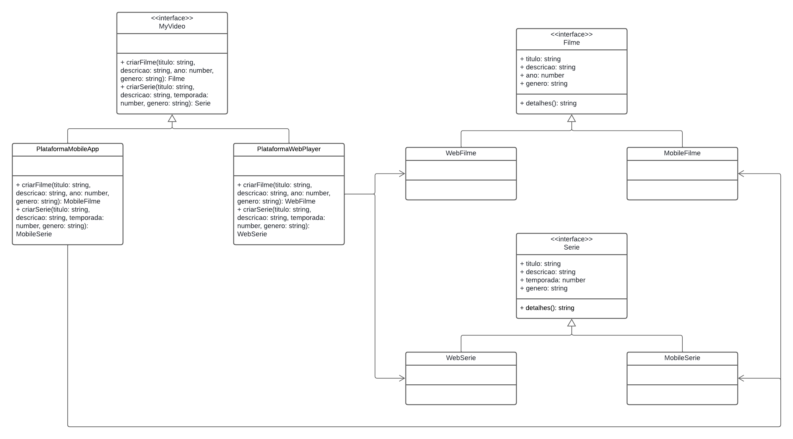

# Abstract Factory

## Introdução

O padrão de projeto Abstract Factory é um padrão criacional que fornece uma interface para criar famílias de objetos relacionados ou dependentes sem especificar suas classes concretas. Ele permite que você crie conjuntos de objetos que funcionam bem juntos, promovendo a consistência e a intercambiabilidade dos objetos criados. Este padrão é útil quando você precisa criar várias famílias de produtos ou objetos e deseja garantir que os objetos de uma família sejam compatíveis entre si.

## Metodologia

**1. AbstractFactory (Fábrica Abstrata):** Declara um conjunto de métodos para criar cada um dos produtos abstratos. Esses métodos são geralmente abstratos ou implementados por classes derivadas.

**2. ConcreteFactory (Fábrica Concreta):** Implementa os métodos da AbstractFactory para criar instâncias de produtos concretos.

**3. AbstractProduct (Produto Abstrato):** Declara uma interface para um tipo de produto. Todas as variantes do produto devem implementar essa interface.

**4. ConcreteProduct (Produto Concreto):** Implementa a interface AbstractProduct. Há uma implementação concreta para cada variante do produto.

**5. Client (Cliente):** Usa apenas interfaces declaradas pela AbstractFactory e AbstractProduct. O cliente não conhece as classes concretas dos produtos, o que promove a flexibilidade e a intercambiabilidade.

## Abstract Factory

### 1. Diagrama

## Referências

## Histórico de Versão

| Versão | Data da alteração |            Alteração             |                                           Autor(es)                                           |                                                                   Revisor(es)                                                                    | Data de revisão |
| :----: | :---------------: | :------------------------------: | :-------------------------------------------------------------------------------------------: | :----------------------------------------------------------------------------------------------------------------------------------------------: | :-------------: |
|  1.0   |    23/07/2024     |       Criação do documento       | [Lucas Ribeiro](https://github.com/lucassouzs) e [Luiz Gustavo](https://github.com/Luiz-GL-Campos) |  |