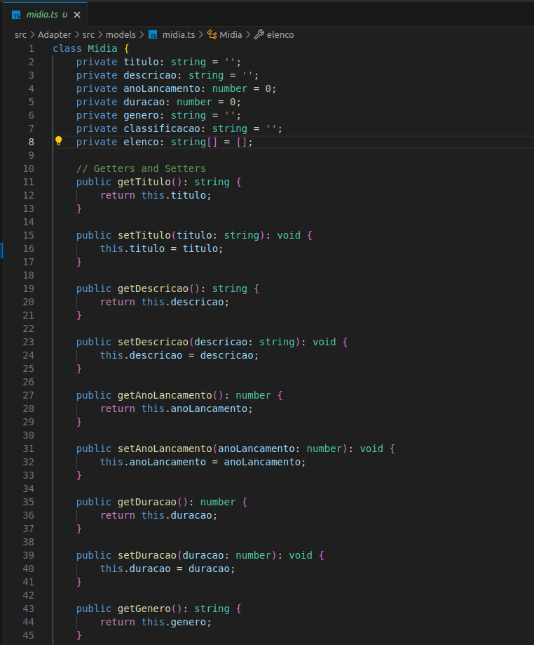

# Adapter

## Introdução

Nesse artefato iremos abordar a aplicação do padrão de projeto Adapter no contexto do My Video. O Adapter é utilizado para permitir que interfaces incompatíveis trabalhem juntas. Ele age como um “adaptador” assim como adaptadores do mundo real, para fazer a conexão correta entre dois objetos, traduzindo a interface de um objeto para uma interface esperada por outro. Esse padrão é especialmente útil quando há a necessidade de integrar classes de bibliotecas ou sistemas legados que possuem interfaces distintas.

Sob esse viés, o padrão Adapter é uma ferramenta essencial no design de software orientado a objetos, facilitando a interoperabilidade entre componentes de software e contribuindo para a construção de sistemas mais robustos e mantíveis.

## Metodologia

Como metodologia, seguimos os seguintes passos:
 

**1. Análise do projeto:** É feita uma análise sobre o que já está desenvolvido, por exemplo, nosso diagrama de classes, a fim de encontrar os possíveis pontos para a aplicação do Adapter

**2. Criação do novo diagrama:** É a fase em que aplicamos as alterações ainda no âmbito conceitual e documentamos o processo através de diagramas

**3. Implementação o Adapter:** Utilizamos a linguagem Java e a IDE IntelliJ para implementar de maneira prática o que estava definido de maneira conceitual pelos diagramas

## Adapter

### 1. Aplicação

   

### 2. Modelagem

   
<iframe allowfullscreen frameborder="0" style="width:640px; height:480px" src="https://lucid.app/documents/embedded/07f46bea-9749-4507-9e8b-24b87cebfe02" id="opiXa7LadhuU"></iframe>

   
<b>Fonte:</b> <a href="https://github.com/GZaranza">Gabriel Zarabza</a>, 2024

### 3. Código

Para acessar a implementação em código do padrão Adapter, basta clicar [aqui](https://github.com/UnBArqDsw2024-1/2024.1_G4_My_Video/tree/main/src/Adapter). Nesta pasta podemos encontrar todos os arquivos que servem de base para a implementação do padrão Adapter, como será demonstrado neste documento.

Os códigos foram desenvolvidos em TypeScript e estão organizados em três tipos principais de arquivos: adapters, models e main.

- **Adapters:** Os arquivos deste tipo implementam o padrão de projeto Adapter, que é utilizado para permitir que classes com interfaces incompatíveis possam trabalhar juntas. Eles contêm as classes adaptadoras que ajustam a interface de um objeto para que seja compatível com a interface que o cliente espera.
- **Models:** Os arquivos deste tipo definem as classes de modelo usadas na aplicação. Estas classes representam os dados e comportamentos dos objetos que serão adaptados pelas classes adaptadoras.
- **Main:** O arquivo `main.ts` contém o código principal que utiliza os adaptadores para adaptar e manipular objetos das classes de modelo. Este arquivo é responsável por testar a implementação do padrão Adapter e verificar se os objetos são manipulados corretamente após a adaptação.

Cada um desses arquivos é crucial para a implementação e o entendimento do padrão Adapter, oferecendo uma visão clara de como o padrão é aplicado para ajustar interfaces e permitir a integração entre objetos com interfaces diferentes, como podemos ver nas figuras 1-10:

#### Adapters:

- filme-adapter.ts:

  
Figura 1 - Filme Adapter. (Fonte: Ana Rocha. 2024)

#### Models:

- midia.ts:

  
Figuras 2 e 3 - Filme Model. (Fonte: Ana Rocha. 2024)

- filme.ts:

  
Figura 4 - Filme Model. (Fonte: Ana Rocha. 2024)

- serie.ts:

  
Figuras 5 - Serie Model. (Fonte: Ana Rocha. 2024)

- episodio.ts:

  
Figura 6 - Episodio Model. (Fonte: Ana Rocha. 2024)

- temporada.ts:

  
Figura 7 - Temporada Model. (Fonte: Ana Rocha. 2024)

#### Main:

- main.ts:

  
Figuras 8, 9 e 10 - Função Principal. (Fonte: Ana Rocha. 2024)

### 4. Console

Após a execução do código principal, a saída obtida no console do terminal é ilustrada na figura 11:

  
Figura 11 - Saída do Console. (Fonte: Ana Rocha. 2024)

## Conclusão

O padrão Adapter é uma solução eficaz para integrar classes incompatíveis sem modificar seu código original, promovendo a reutilização e flexibilidade do sistema. Ao atuar como um intermediário, o Adapter permite que interfaces distintas trabalhem em conjunto, facilitando a integração de novos componentes e serviços, desempenhando um papel crucial na criação de software robusto e escalável. A aplicação correta deste padrão resulta em sistemas mais coesos e adaptáveis às constantes mudanças e demandas do ambiente tecnológico.

## Referências

- SERRANO, Milene. Slide "MODELAGEM UML DINÂMICA". Disponível em: [Aprender 3](https://aprender3.unb.br/pluginfile.php/2790248/mod_label/intro/Arquitetura%20e%20Desenho%20de%20Software%20-%20Aula%20Modelagem%20UML%20Din%C3%A2mica%20-%20Profa.%20Milene.pdf). Acesso em 06 jul. de 2024.  
- FIGUEIREDO, Eduardo. Postagem "Diagrama de Comunicação". Disponível em: [UML Diagrams Org](https://homepages.dcc.ufmg.br/~figueiredo/disciplinas/aulas/uml-diagrama-comunicacao_v01.pdf). Acesso em 06 jul. de 2024.  

## Histórico de Versão

| Versão | Data da alteração |            Alteração             |                                           Autor(es)                                           |                                                                   Revisor(es)                                                                    | Data de revisão |
| :----: | :---------------: | :------------------------------: | :-------------------------------------------------------------------------------------------: | :----------------------------------------------------------------------------------------------------------------------------------------------: | :-------------: |
|  1.0   |    22/07/2024     |       Criação do documento       | [Lucas Lobão](https://github.com/lucaslobao-18) e [Catlen Cleane](https://github.com/catlenc) | [Ana Rocha](https://github.com/anaaroch) | 24/07/2024 |
|  1.1   |    24/07/2024     |      Adição do diagrama      | [Gabriel Zaranza](https://github.com/GZaranza)  | [Ana Beatriz](github.com/anabfs) e [Jefferson França](https://github.com/Frans6) | 24/07/2024
|  1.2   |    24/07/2024     |      Corrigindo link do diagrama      | [Gabriel Zaranza](https://github.com/GZaranza)  | [Caio Santos](https://github.com/caiobsantos) | 24/07/2024 |
|  1.3   |    24/07/2024     |      Adiciona conclusão      | [Caio Santos](https://github.com/caiobsantos)  | [Breno Yuri](https://github.com/YuriBre) | 24/07/2024 |
|  1.4   |    24/07/2024     |      Adicionando os Códigos      | [Ana Rocha](https://github.com/anaaroch), [Marcelo Magalhães](https://github.com/marrcelo) e [Luiz Gustavo](https://github.com/Luiz-GL-Campos) | | |