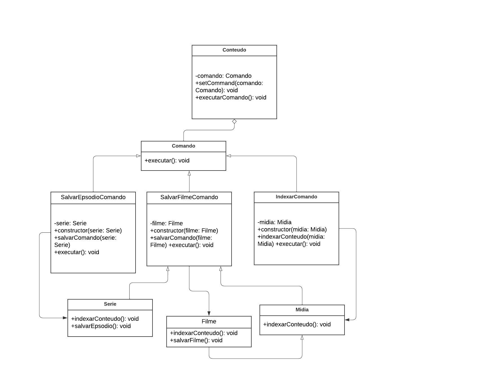

# Command

## Introdução

O padrão Command é um dos padrões comportamentais propostos pelo GOF e se destaca por encapsular solicitações em objetos distintos. Em vez de realizar uma ação diretamente, o padrão permite que a solicitação seja representada como um objeto com todas as informações necessárias para sua execução futura. Isso não só facilita o controle e a modificação das operações, mas também torna possível desfazer ou registrar ações, proporcionando uma maior flexibilidade na gestão de comandos em sistemas complexos.

## Metodologia

**1. Command (Comando):** Declara uma interface para executar uma operação. Esta interface é implementada por todas as classes de comando concreto.

**2. ConcreteCommand (Comando Concreto):** Implementa a interface Command e define a ligação entre o objeto Receiver e a ação a ser executada. Contém todas as informações necessárias para chamar o método no objeto Receiver.

**3. Client (Cliente):** Cria um objeto ConcreteCommand e define seu Receiver. O cliente configura e armazena os comandos.

**4. Invoker (Invocador):** Solicita a execução do comando. Pode armazenar um histórico de comandos para permitir operações de desfazer e refazer.

**5. Receiver (Receptor):** Sabe como executar as operações associadas à realização de uma solicitação. Qualquer classe pode atuar como um receptor.

**6. Command History (Histórico de Comandos) (Opcional):** Mantém um histórico de comandos executados para permitir a operação de desfazer e refazer, proporcionando maior controle sobre as ações realizadas.

## Command

### 1. Aplicação

   

### 2. Modelagem

#### 
Figura 1: Diagrama - Primeira Versão (Fonte: Ana Beatriz, Breno Yuri) 

   

### 3. Código

## Conclusão

## Referências

- SERRANO, Milene. Slide "MODELAGEM UML DINÂMICA". Disponível em: [Aprender 3](https://aprender3.unb.br/pluginfile.php/2790248/mod_label/intro/Arquitetura%20e%20Desenho%20de%20Software%20-%20Aula%20Modelagem%20UML%20Din%C3%A2mica%20-%20Profa.%20Milene.pdf). Acesso em 06 jul. de 2024.  
- FIGUEIREDO, Eduardo. Postagem "Diagrama de Comunicação". Disponível em: [UML Diagrams Org](https://homepages.dcc.ufmg.br/~figueiredo/disciplinas/aulas/uml-diagrama-comunicacao_v01.pdf). Acesso em 06 jul. de 2024.  
- WIKIPÉDIA. Command. Disponível em:[Command](https://pt.wikipedia.org/wiki/Command). Acesso em: 23 jul. 2024.

## Histórico de Versão

| Versão | Data da alteração |            Alteração             |                                           Autor(es)                                           |                                                                   Revisor(es)                                                                    | Data de revisão |
| :----: | :---------------: | :------------------------------: | :-------------------------------------------------------------------------------------------: | :----------------------------------------------------------------------------------------------------------------------------------------------: | :-------------: |
|  1.0   |    22/07/2024     |       Criação do documento       | [Lucas Lobão](https://github.com/lucaslobao-18) e [Catlen Cleane](https://github.com/catlenc) | [Ana Rocha](https://github.com/anaaroch) | 24/07/2024 |
|  1.1   |    22/07/2024     |       Introdução      | [Breno Yuri](https://github.com/YuriBre)| [Ana Rocha](https://github.com/anaaroch) | 24/07/2024 |
|  1.2   |    23/07/2024     |       Adição da primeira versão do diagrama      |[Ana Beatriz](https://github.com/anabfs) e [Breno Yuri](https://github.com/YuriBre)| [Ana Rocha](https://github.com/anaaroch) | 24/07/2024 |
|  1.3   |    24/07/2024     |       Metodologia      | [Ana Rocha](https://github.com/anaaroch) | [Gabriel Rosa](https://github.com/gabrielrosa09) | 24/07/2024 |
